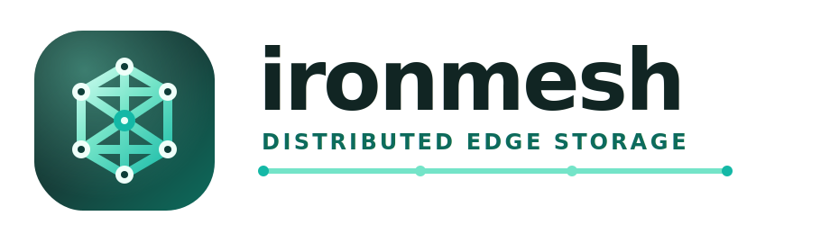
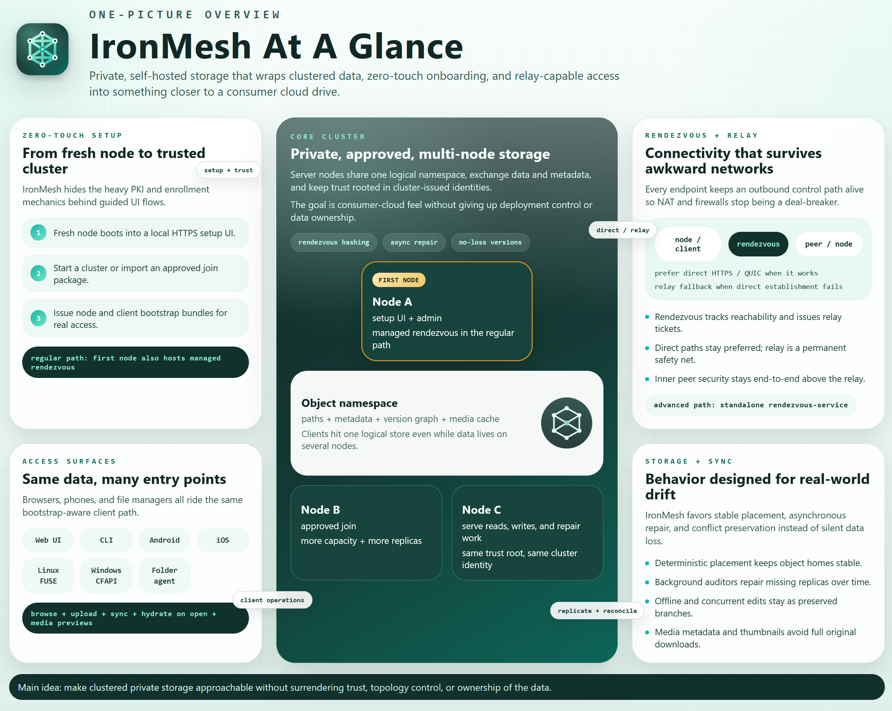

<p align="center">
  
</p>

# Ironmesh

Private, self-hosted storage for files and media, built around clustered server
nodes and native access paths.

Ironmesh is building toward a private, self-hosted storage system that makes clustered files, folders, and media feel as approachable as a consumer cloud drive, while keeping deployment, trust, and data ownership in your hands. The project combines secure multi-node storage, offline-friendly sync and conflict handling, and native filesystem access paths so the same data can surface cleanly in web, mobile, and OS file-manager workflows.

Current direction highlights:

- Cluster-aware storage with deterministic placement, asynchronous replication and repair, and a no-loss version model for offline or concurrent edits.
- Native access paths across the web UI, CLI, Android, Linux FUSE, and Windows CFAPI placeholder integration, with on-demand hydration where the platform supports it.
- Secure onboarding and connectivity through guided zero-touch cluster setup, certificate-backed identities, and rendezvous/relay paths for harder network topologies.
- Media-aware browsing with cached thumbnails and metadata designed to support gallery-style experiences without downloading original files first.

Ironmesh draws inspiration from [PicApport](https://www.picapport.de/de/index.php) on the self-hosted media/gallery side and [Syncthing](https://syncthing.net/) on the private, direct-first synchronization side.

## Personal motivation

As a software engineer, I want the same relationship with my computer and my data that a skilled mechanic has with a car: the ability to repair it, understand it, and extend it when needed. That desire does not come from distrust of large cloud providers, just as a mechanic's wish to work on a car does not imply suspicion of major manufacturers. It comes from knowing the craft well enough to want meaningful influence over the systems one depends on.

Ironmesh is also a test of what is now possible for an individual builder. AI coding agents have expanded the practical reach of small teams and solo engineers by an order of magnitude, and part of this project is to explore that shift seriously. Proving that this kind of ambitious, deeply owned software can be built in a new way is not separate from the project's purpose; it is one of its central goals.

## At A Glance

<p align="center">
  <a href="docs/assets/ironmesh-at-a-glance.png">
    
  </a>
</p>

## Install On Ubuntu

Ironmesh Ubuntu packages are published from the signed apt repository at:

```text
https://creax.de/apt/ironmesh
```

The current package build targets Ubuntu 24.04 LTS (`noble`) on `amd64`.

First install the basic apt transport/key tools:

```bash
sudo apt update
sudo apt install ca-certificates curl gnupg
sudo install -d -m 0755 /usr/share/keyrings
```

Install the Ironmesh repository signing key:

```bash
curl -fsSL https://creax.de/apt/ironmesh/ironmesh-archive-keyring.asc \
  | sudo gpg --dearmor --yes -o /usr/share/keyrings/ironmesh-archive-keyring.gpg
```

Add the apt source:

```bash
echo 'deb [arch=amd64 signed-by=/usr/share/keyrings/ironmesh-archive-keyring.gpg] https://creax.de/apt/ironmesh noble main' \
  | sudo tee /etc/apt/sources.list.d/ironmesh.list
```

Install the server-node package:

```bash
sudo apt update
sudo apt install ironmesh-server-node
```

## Start A Server Node

The `ironmesh-server-node` package installs a systemd service, but it does not
start it automatically. Configure the service first:

```bash
sudoedit /etc/ironmesh/server-node.env
```

For a first node in a new cluster, this minimal configuration is enough:

```bash
IRONMESH_DATA_DIR=/var/lib/ironmesh-server-node
IRONMESH_SERVER_BIND=0.0.0.0:8443
```

Then enable the service for boot and start it immediately:

```bash
sudo systemctl enable --now ironmesh-server-node.service
```

Check the service:

```bash
systemctl status ironmesh-server-node.service
journalctl -u ironmesh-server-node.service -f
```

Open the setup UI in a browser:

```text
https://<server-hostname-or-ip>:8443/
```

Accept the temporary self-signed certificate warning, choose `Start a new
cluster` on the first node, and use the setup UI to connect additional nodes.

The package creates a dedicated `ironmesh-server-node` system user. The service
runs as that user, and systemd creates `/var/lib/ironmesh-server-node` as its
state directory.

If you upgrade from an earlier beta package that ran the service as `root`, fix
existing data ownership once:

```bash
sudo chown -R ironmesh-server-node:ironmesh-server-node /var/lib/ironmesh-server-node
sudo systemctl restart ironmesh-server-node.service
```

## Developer Documentation

Developer-oriented workspace notes, local test commands, runtime environment
contracts, and API details live in
[docs/developer-workspace.md](docs/developer-workspace.md).
